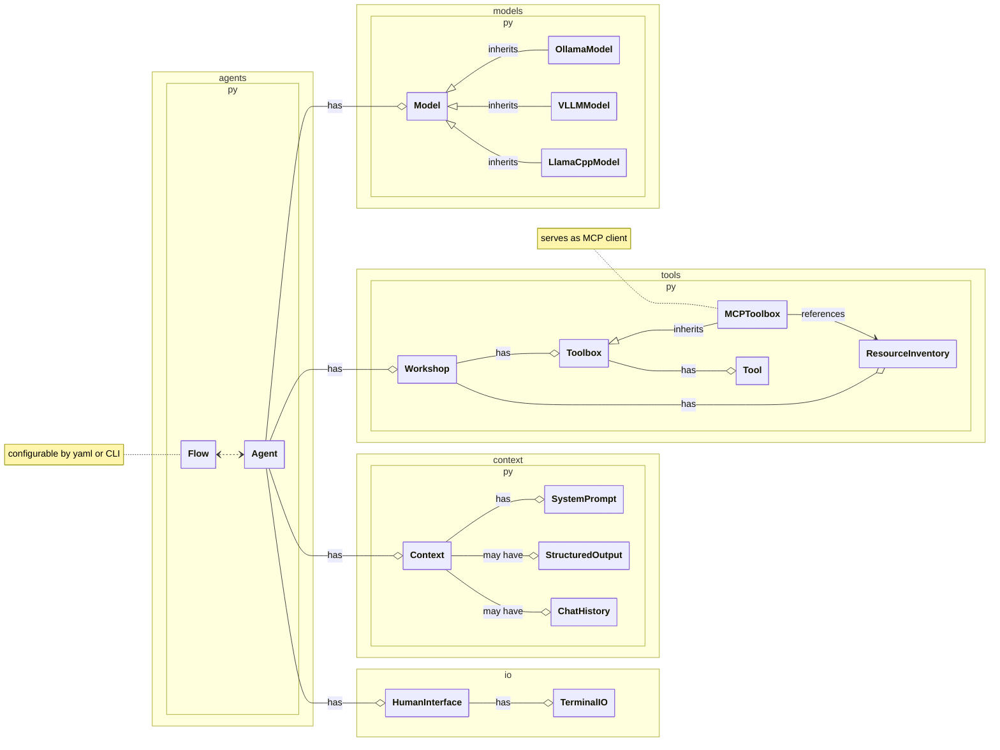

# flat-mcp-client
*F*ast *L*ocal *A*gents with *T*ools (mcp-client edition) is a lightweight package for connecting local (self-hosted) LLMs to tooling+data and for prototyping agentic flows.  The philosophy behind this codebase is streamlined invocation of standard inferencing APIs (ollama, vllm, llama.cpp via OpenAI interface compatibility) without relying on other agent frameworks!

## How fast?

Benchmarking a query requiring a sequence of multiple tool calls followed by a summary of a weather forecast, here are results of flat optimized on an _RTX 4090 laptop GPU_:

Highlight: **gpt-oss-20b blazes at 80+ generated tokens per second!**


| stats | Ollama  | vLLM | Llama.cpp |
|:-------------|:-------------:|:-------------:|:-------------:|
| **Qwen3-8B** | [Q4_K_M](https://ollama.com/library/qwen3:8b-q4_K_M)  | [GPTQ-Int4](https://huggingface.co/JunHowie/Qwen3-8B-GPTQ-Int4)  | [Q4_K_M](https://huggingface.co/unsloth/Qwen3-8B-GGUF?show_file_info=Qwen3-8B-Q4_K_M.gguf) |
| context size | 32768 | 32768 | 32768 |
| VRAM usage (GB) | 11.798 | 14.812 | **9.738** |
| input tokens/sec | 4488.42 | 4905.77 | **5897.00**|
| output tokens/sec | **44.05** | 33.86 | 40.32|
| average time to first token (s) | 0.379 | **0.187** | 0.189|
| total inference time (s) | 17.71 | 33.43 | **12.55**|
| **Mistral-Small-3.2** | [IQ4_XS](https://huggingface.co/unsloth/Mistral-Small-3.2-24B-Instruct-2506-GGUF?show_file_info=Mistral-Small-3.2-24B-Instruct-2506-IQ4_XS.gguf) | - | [IQ4_XS](https://huggingface.co/unsloth/Mistral-Small-3.2-24B-Instruct-2506-GGUF?show_file_info=Mistral-Small-3.2-24B-Instruct-2506-IQ4_XS.gguf) |
| context size | 8192 | - | 8192 |
| VRAM usage | 14.716  | - | **14.58** |
| input tokens/sec | 1130.23 | - | **1527.72** |
| output tokens/sec | 16.72 | - | **23.18** |
| average time to first token | 1.25 | - | **0.535** |
| total inference time* | **6.872** | - | 10.98 |
| **GPT-OSS-20B** | [MXFP4](https://ollama.com/library/gpt-oss:20b) | -  | [MXFP4](https://huggingface.co/ggml-org/gpt-oss-20b-GGUF) |
| context size | 32768  | -  | 32768 |
| VRAM usage | **13.88**  | -  | 15.58  |
| input tokens/sec | 2259.54  | - | **4811.07** |
| output tokens/sec | 61.78 | - | **83.36**  |
| average time to first token | 0.502 | - | **0.150** |
| total inference time | 3.156 | - | **1.768** |

* Behavior differed for the same Mistral GGUF file in Ollama and in Llama.cpp, with Ollama consistently requiring one extra inference call to succeed in the task and still falling short on quality despite seemingly all of the same parameter settings.

## Quick start
```sh
uv run flat chatloop --help
```

## Tools

See `src/flat_mcp_client/tool_defs` for examples.

Equipping your agents with additional tools is as simple as:
1. adding the tools' pydantic descriptions and python functions to a new file in the `tool_defs` directory, e.g., `tool_defs/my_new_toolbox.py`
2. referenceing it when you start an agent chatloop, such as with `uv run flat chatloop --tools my_new_toolbox`

## MCP Servers

MCP servers are prescribed in the same way that tools are.  See one example at `src/flat_mcp_client/tool_defs/crawl4ai.py`

## Additional Features

- Streaming console output, including streaming of the tool calls made by LLMs served by vLLM and llama.cpp
- Flexible agentic flow with one of several predefined turn termination conditions (e.g., `no further tool calls` will allow an agent to automatically chain tools and only stop once it has finished calling tools or a maximum number of inference calls has been reached)

## Wishlist
- [ ] Support for MCP resources
- [ ] Support for Tool Approvals and MCP Elicitations

## Structure of code


