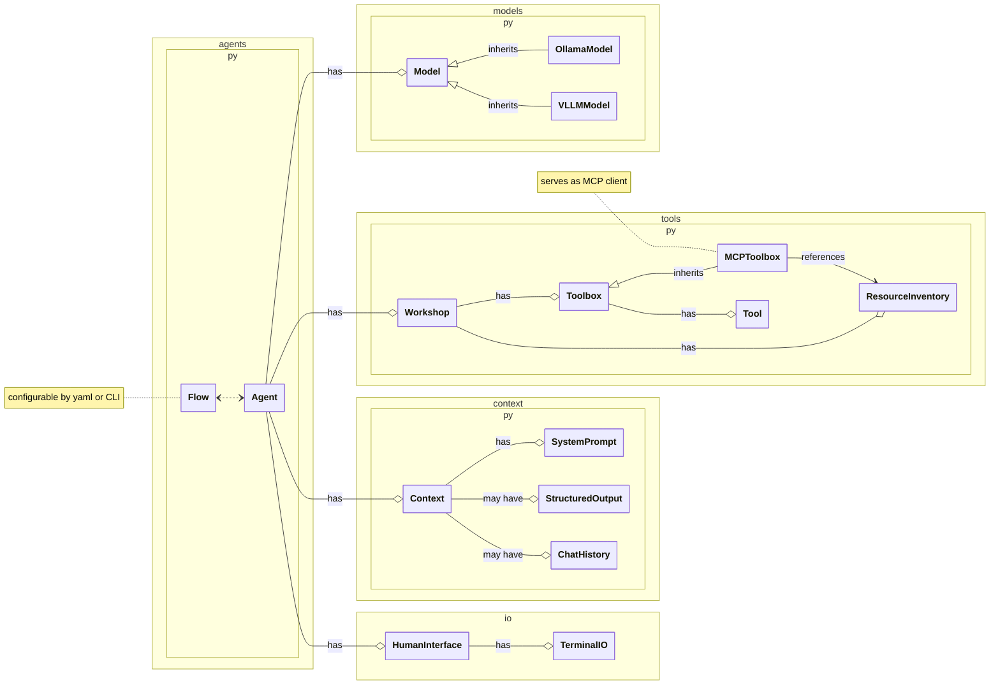

# flat-mcp-client
*F*ast *L*ocal *A*gents with *T*ools (mcp-client edition) is a lightweight package for connecting local (self-hosted) LLMs to tooling+data and for prototyping agentic flows.  The philosophy behind this codebase is streamlined invocation of standard inferencing APIs (ollama, vllm via OpenAI interface compatibility) without relying on other agent frameworks!

## Quick start
```sh
uv run flat chatloop --help
```

## Tools

See `src/flat_mcp_client/tool_defs` for examples.

Equipping your agents with additional tools is as simple as:
1. adding the tools' pydantic descriptions and python functions to a new file in the `tool_defs` directory, e.g., `tool_defs/my_new_toolbox.py`
2. referenceing it when you start an agent chatloop, such as with `uv run flat chatloop --tools my_new_toolbox`

## MCP Servers

MCP servers are prescribed in the same way that tools are.  See one example at `src/flat_mcp_client/tool_defs/crawl4ai.py`

## Additional Features

- Streaming console output, including streaming of the tool calls made by LLMs served by vLLM
- Flexible agentic flow with one of several predefined turn termination conditions (e.g., `no further tool calls` will allow an agent to automatically chain tools and only stop once it has finished calling tools or a maximum number of inference calls has been reached)

## Wishlist
- [ ] Support for MCP resources
- [ ] Support for Tool Approvals and MCP Elicitations

## Structure of code


